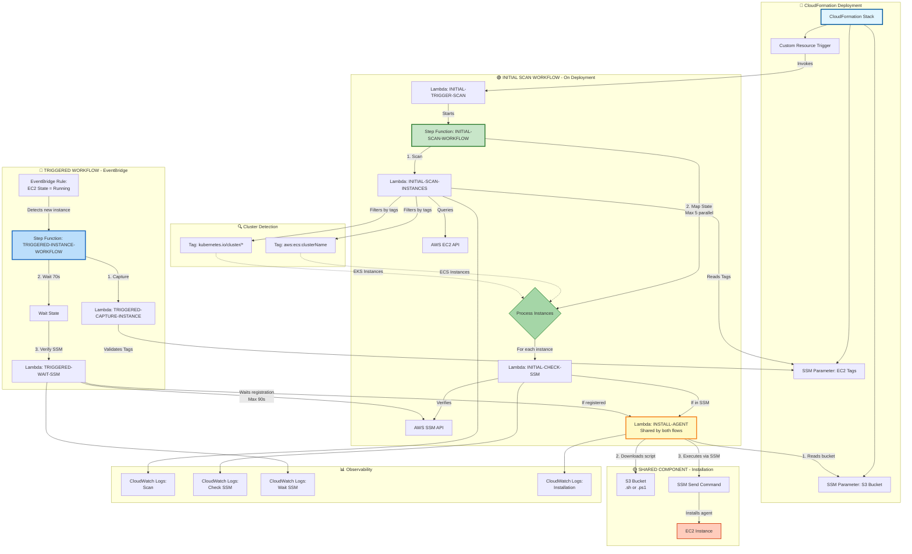
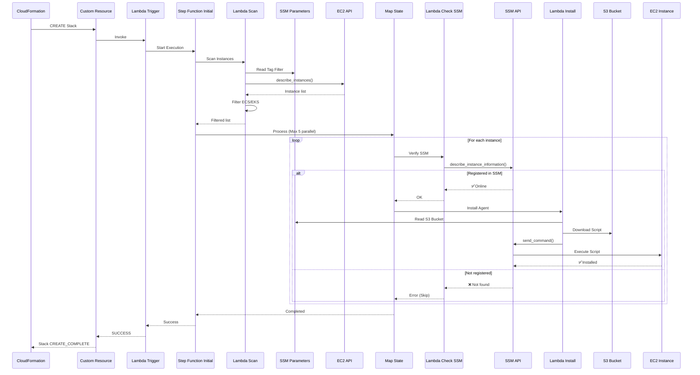
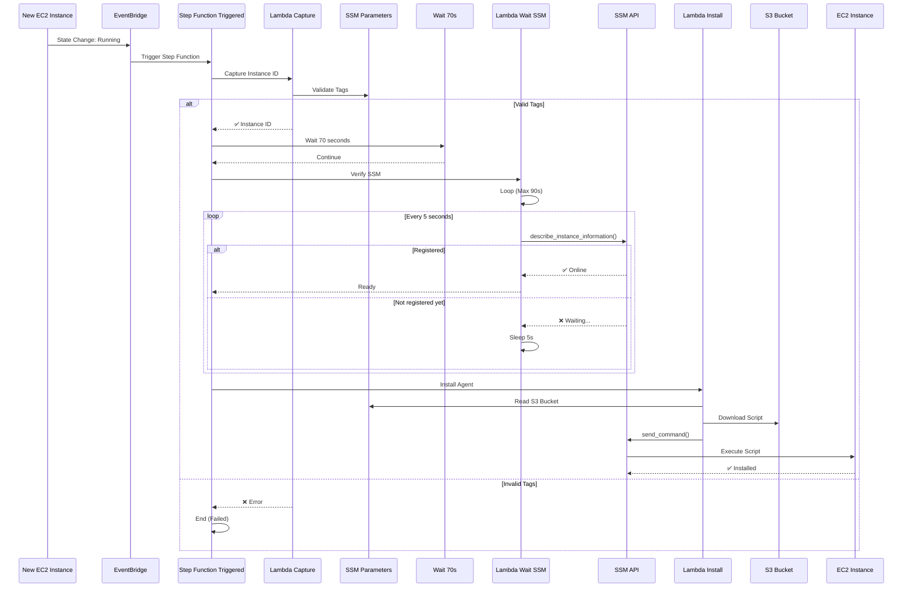
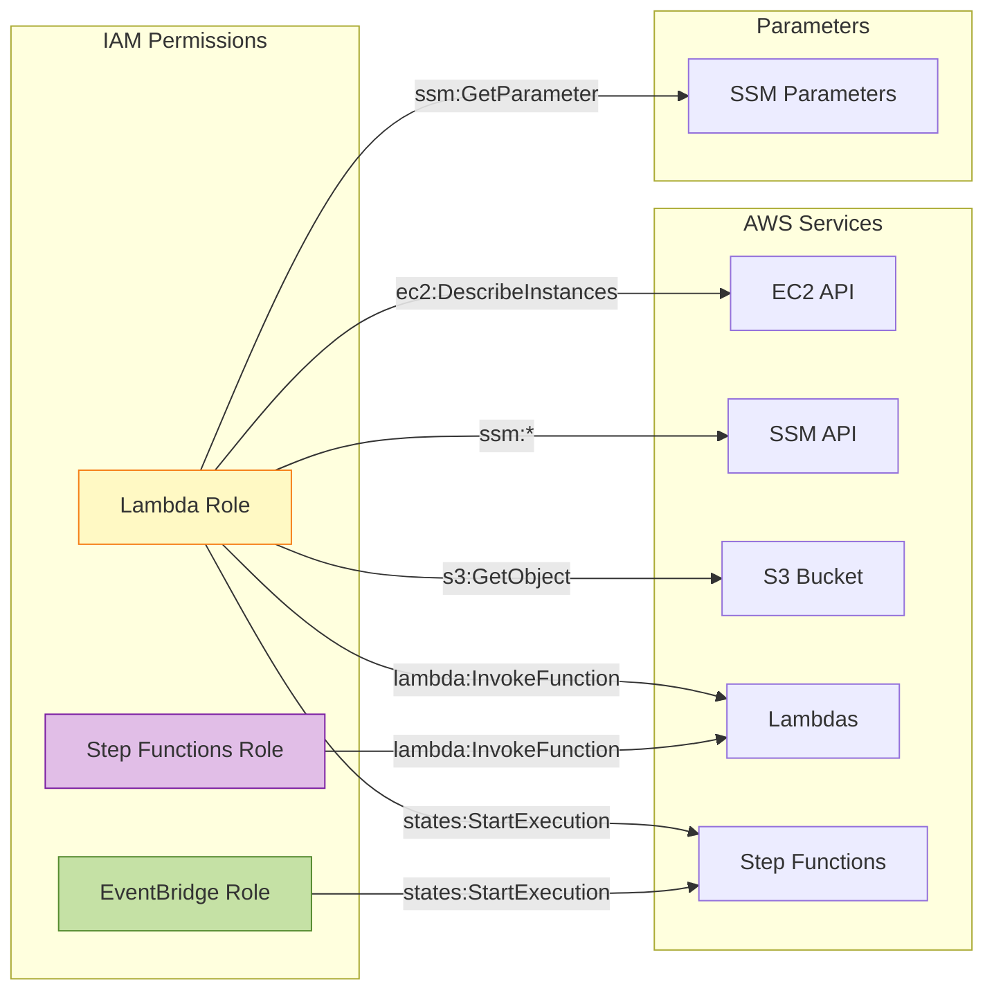

# 🏗️ Architecture - Trend Micro Agent Service

## 📐 Complete Architecture Diagram



## 🔄 Detailed Workflow

### **Flow 1: Initial Scan (On CloudFormation Deployment)**



### **Flow 2: Triggered (New EC2 Instance)**



## 🎯 Key Components

### **Lambdas by Purpose**

| Lambda | Purpose | Timeout | Memory | Process |
|--------|---------|---------|--------|---------|
| **INITIAL-SCAN-INSTANCES** | Scans all EC2 instances and filters ECS/EKS | 300s | 512MB | Initial |
| **INITIAL-CHECK-SSM** | Verifies SSM registration without waiting | 30s | 256MB | Initial |
| **INITIAL-TRIGGER-SCAN** | Starts Step Function on deployment | 120s | 128MB | Initial |
| **TRIGGERED-CAPTURE-INSTANCE** | Captures and validates tags of new instance | 90s | 300MB | Triggered |
| **TRIGGERED-WAIT-SSM** | Waits up to 90s for instance to register in SSM | 120s | 300MB | Triggered |
| **INSTALL-AGENT** | Installs Trend Micro agent via SSM | 90s | 300MB | Shared |

### **Step Functions**

| Step Function | States | Concurrency | Purpose |
|---------------|--------|-------------|---------|
| **INITIAL-SCAN-WORKFLOW** | 6 states | Max 5 parallel | Initial scan on deployment |
| **TRIGGERED-INSTANCE-WORKFLOW** | 4 states | 1 per instance | New instance via EventBridge |

### **IAM Resources**

- **LAMBDA-ROLE**: Permissions for EC2, SSM, S3, Lambda invoke, Step Functions
- **STEP-FUNCTIONS-ROLE**: Permissions to invoke Lambdas
- **EVENTBRIDGE-ROLE**: Permissions to start Step Function

## 🔐 Security



## 📈 Scalability and Performance

### **Concurrency Control**

```yaml
Initial Scan Workflow:
  - Map State MaxConcurrency: 5
  - Controlled parallel processing
  - Prevents API saturation
  - Optimizes costs

Triggered Workflow:
  - 1 instance at a time
  - No limit on total instances
  - EventBridge handles queue
```

### **Retries and Fault Tolerance**

| Component | Retries | Interval | BackoffRate |
|-----------|---------|----------|-------------|
| Check SSM (Initial) | 2 | 10s | 2x |
| Install Agent | 2 | 5s | 1.5x |
| Wait SSM (Triggered) | 3 | 10s | 2x |

## 📊 Monitoring

### **CloudWatch Logs - Structure**

```
/aws/lambda/TRENDMICRO-AGENT-SERVICE-INITIAL-SCAN-INSTANCES
├── [START] Scan initiated
├── [INFO] Required tags: {...}
├── ✓ ECS - Instance: i-xxx, Cluster: prod
├── ✓ EKS - Instance: i-yyy, Cluster: k8s
└── [SUMMARY] Total: 10, ECS: 5, EKS: 5

/aws/lambda/TRENDMICRO-AGENT-SERVICE-INITIAL-CHECK-SSM
├── [START] Checking i-xxx
├── [SUCCESS] Registered in SSM
├── [SSM INFO] Platform: Linux
└── [COMPLETED] Ready for installation

/aws/lambda/TRENDMICRO-AGENT-SERVICE-INSTALL-AGENT
├── [START] Processing i-xxx
├── [S3] Script: install-agent.sh
├── [SSM] Command sent
└── [COMPLETED] Command ID: abc-123
```

## 💰 Cost Estimation

**Example: 20 ECS/EKS instances in initial scan**

| Service | Quantity | Unit Cost | Total |
|---------|----------|-----------|-------|
| Lambda Invocations | ~45 | $0.0000002 | $0.000009 |
| Lambda Duration (GB-s) | ~30 GB-s | $0.0000166667 | $0.0005 |
| Step Functions Transitions | ~50 | $0.000025 | $0.00125 |
| **TOTAL per deployment** | | | **~$0.002** |

**Estimated monthly cost** (1 deployment + 50 new instances):
- Initial Scan: $0.002
- Triggered (50 instances): $0.002
- **Total: ~$0.004/month** ✨

---

## 🎨 Color Legend

- 🔷 **Light Blue**: CloudFormation / Deployment
- 🟢 **Green**: Initial Scan Workflow
- 🔵 **Blue**: Triggered Workflow (EventBridge)
- 🟡 **Yellow**: Shared Components
- 🔴 **Red/Orange**: EC2 Instances (Target)
