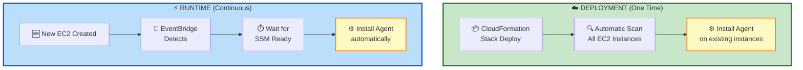
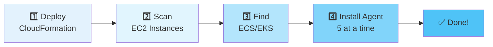
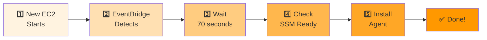
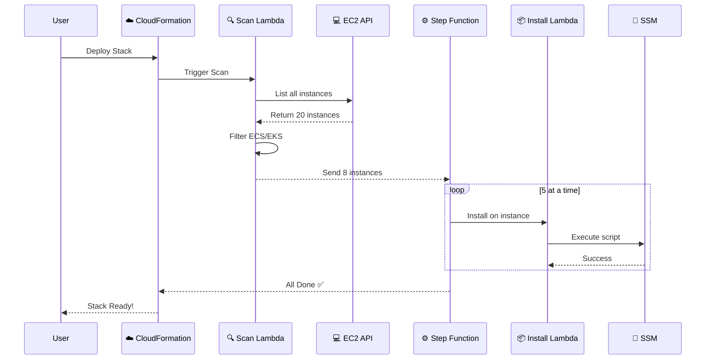
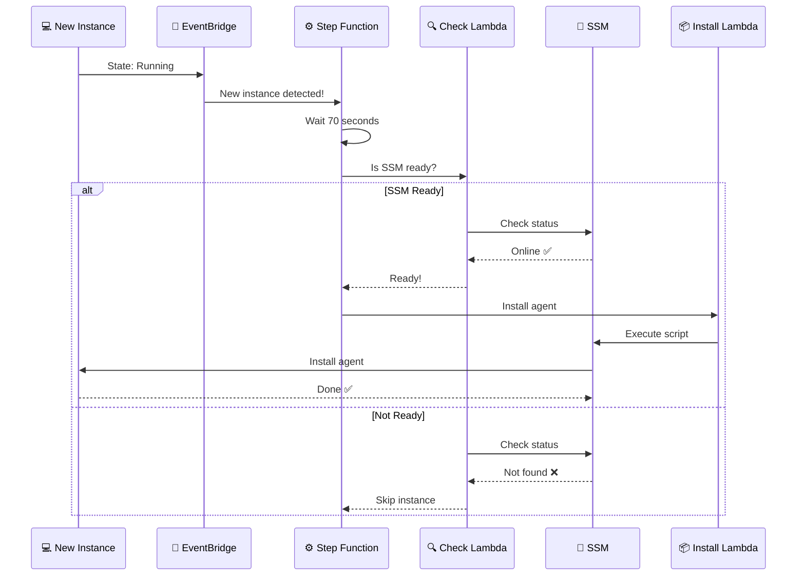
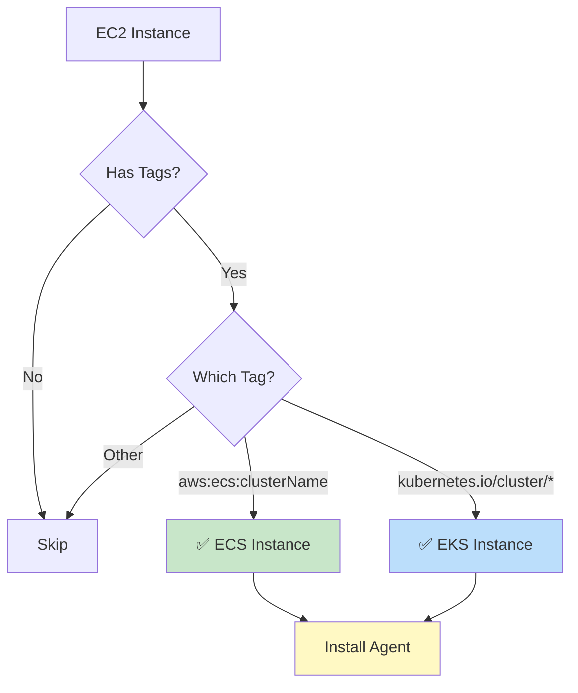
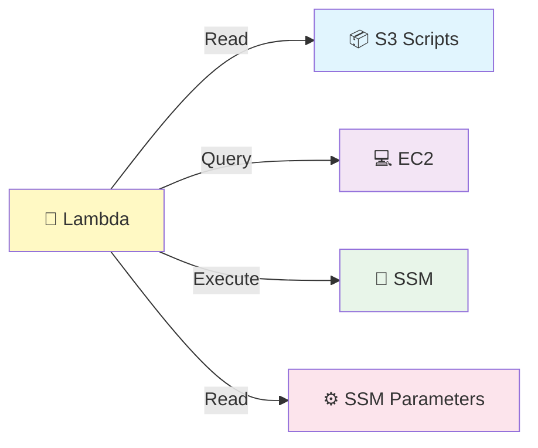
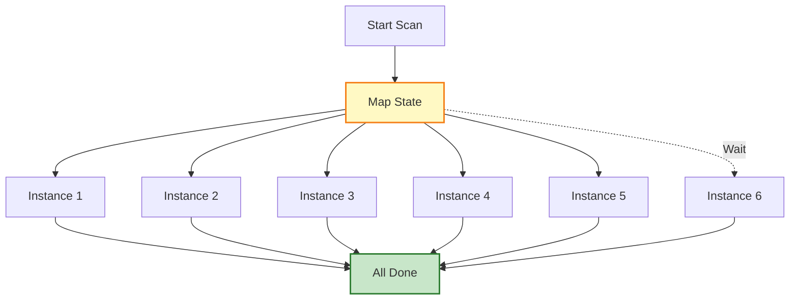

# 🏗️ Architecture - Trend Micro Agent Service

## 📐 Simple Architecture Overview



## 🎯 How It Works

### **Scenario 1: First Time Deployment** 🚀



### **Scenario 2: New Instance Created** ⚡



## 🔄 Detailed Flow - Initial Scan



## 🔄 Detailed Flow - New Instance



## 🎯 Key Components

### **AWS Resources**

| Resource | Name | Purpose |
|----------|------|---------|
| 🔍 Lambda | INITIAL-SCAN-INSTANCES | Scans all EC2 instances |
| 🔍 Lambda | INITIAL-CHECK-SSM | Checks if SSM is ready (no wait) |
| ⏱️ Lambda | TRIGGERED-WAIT-SSM | Waits for SSM (up to 90s) |
| 📦 Lambda | INSTALL-AGENT | Installs the agent (shared) |
| ⚙️ Step Function | INITIAL-SCAN-WORKFLOW | Orchestrates initial scan |
| ⚙️ Step Function | TRIGGERED-INSTANCE-WORKFLOW | Orchestrates new instances |
| 👀 EventBridge | EC2-RUNNING-RULE | Detects new instances |

### **How Instances Are Detected**



## 📊 Monitoring

### **CloudWatch Logs Examples**

**Initial Scan:**
```
[START] Starting EC2 instance scan
✓ ECS - Instance: i-abc123, Cluster: prod-ecs
✓ EKS - Instance: i-def456, Cluster: k8s-prod
[SUMMARY] Total: 20, ECS: 12, EKS: 8
```

**Installation:**
```
[START] Processing installation for instance: i-abc123
[S3] Selected script: install-agent.sh
[SSM] Command sent successfully
[SSM] Command ID: a1b2c3d4-e5f6-7890
[COMPLETED] Installation initiated
```

## 🔐 Security



## 📈 Scalability

### **Parallel Processing**



**Why Max 5?**
- ✅ Prevents overwhelming AWS APIs
- ✅ Reduces costs
- ✅ Ensures reliability
- ✅ If 5 finish, next 5 start automatically

## 🎨 Color Legend

- 🟢 **Green**: Initial Scan (on deployment)
- 🔵 **Blue**: Triggered Mode (new instances)
- 🟡 **Yellow**: Shared components
- ⚪ **White**: AWS Services

